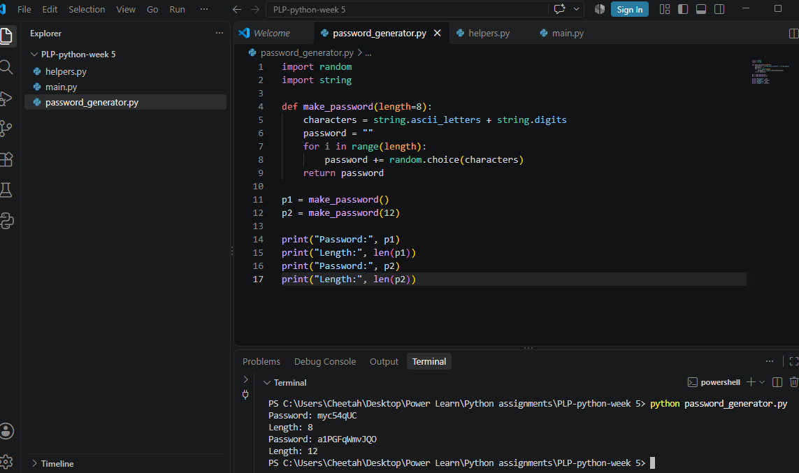
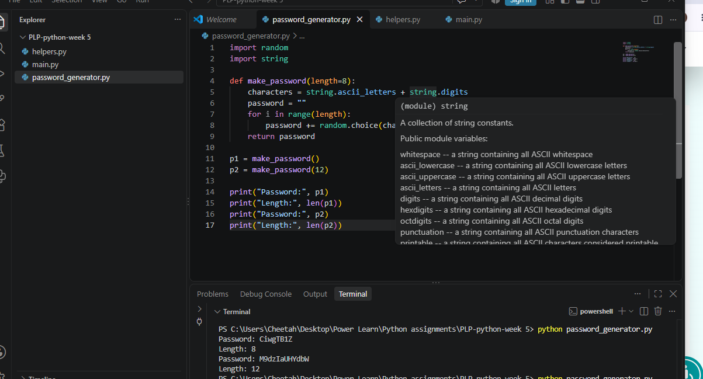
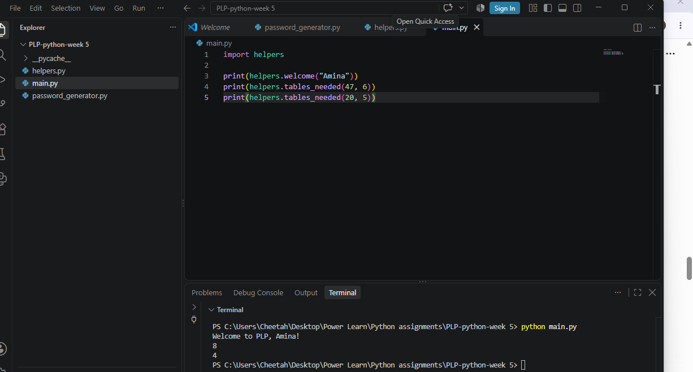
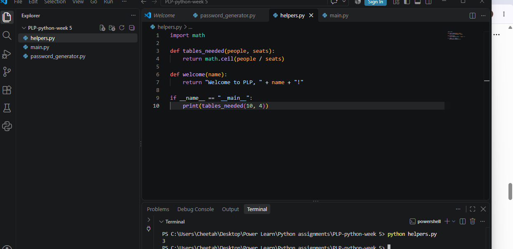

# Week 5 Assignment – Password Generator & Your Own Module

##  Project Overview

This project is part of the **Power Learn Project (PLP) Python Programming** course.

The assignment focuses on using Python modules, including built-in modules and a module created by the programmer.

The project demonstrates:

* Importing Python modules using `import`
* Using the `random` module
* Using the `string` module
* Using the `math` module
* Creating functions with default values
* Creating and importing a custom Python module
* Using `if __name__ == "__main__":`

---

##  Project Files

| File                    | Description                                                                       |
| ----------------------- | --------------------------------------------------------------------------------- |
| `password_generator.py` | Generates random passwords using the `random` and `string` modules                |
| `helpers.py`            | Contains custom functions for calculating tables and displaying a welcome message |
| `main.py`               | Imports and uses functions from `helpers.py`                                      |
| `screenshots/`          | Contains screenshots showing the program outputs                                  |

---

# Question 1 – Password Generator

The `password_generator.py` program uses Python's built-in `random` and `string` modules.

It creates passwords using:

```python
characters = string.ascii_letters + string.digits
```

The program uses `random.choice()` to select random characters.

The `make_password()` function has a default password length of **8 characters**, but it can also generate passwords of other lengths.

### Example Code

```python
def make_password(length=8):
    characters = string.ascii_letters + string.digits
    password = ""

    for i in range(length):
        password += random.choice(characters)

    return password
```

The program generates:

* One 8-character password
* One 12-character password

### Password Generator – Run 1



### Password Generator – Run 2



The passwords are randomly generated, so the results are different each time the program is run.

---

# Question 2 – Creating My Own Module

For this part of the assignment, I created a module called `helpers.py`.

The module contains two functions:

### 1. `tables_needed()`

This function calculates the number of tables required using `math.ceil()`.

```python
def tables_needed(people, seats):
    return math.ceil(people / seats)
```

For example:

```python
tables_needed(47, 6)
```

returns:

```text
8
```

### 2. `welcome()`

This function creates a welcome message using the name provided.

```python
def welcome(name):
    return "Welcome to PLP, " + name + "!"
```

---

# Using the Custom Module

The `main.py` file imports my custom module using:

```python
import helpers
```

It then calls the functions from `helpers.py`.

The expected output is:

```text
Welcome to PLP, Amina!
8
4
```

### Main Program Output



---

# Running helpers.py Independently

The `helpers.py` file contains:

```python
if __name__ == "__main__":
    print(tables_needed(10, 4))
```

When `helpers.py` is run directly, it produces:

```text
3
```

### Helpers Output



When `helpers.py` is imported into `main.py`, the `3` is not printed because the `if __name__ == "__main__":` condition is not executed during the import.

---

#  Key Concepts Learned

Through this assignment, I learned how to:

1. Import built-in Python modules.
2. Use the `random` module to generate random values.
3. Use the `string` module to obtain letters and digits.
4. Use the `math.ceil()` function to round numbers upward.
5. Create functions with default parameter values.
6. Create my own Python module.
7. Import a custom module into another Python program.
8. Use `if __name__ == "__main__":` to control code execution.
9. Organize Python programs into separate files.

---

# ▶️ How to Run the Programs

Open the terminal in the project folder and run:

### Password Generator

```bash
python password_generator.py
```

### Main Program

```bash
python main.py
```

### Helpers Module

```bash
python helpers.py
```

---


#  Screenshots

All assignment screenshots are stored in the `screenshots` folder.

| Screenshot           | Purpose                       |
| -------------------- | ----------------------------- |
| `password_run1.png`  | First password generator run  |
| `password_run2.png`  | Second password generator run |
| `main_output.png`    | Output from `main.py`         |
| `helpers_output.png` | Output from `helpers.py`      |

